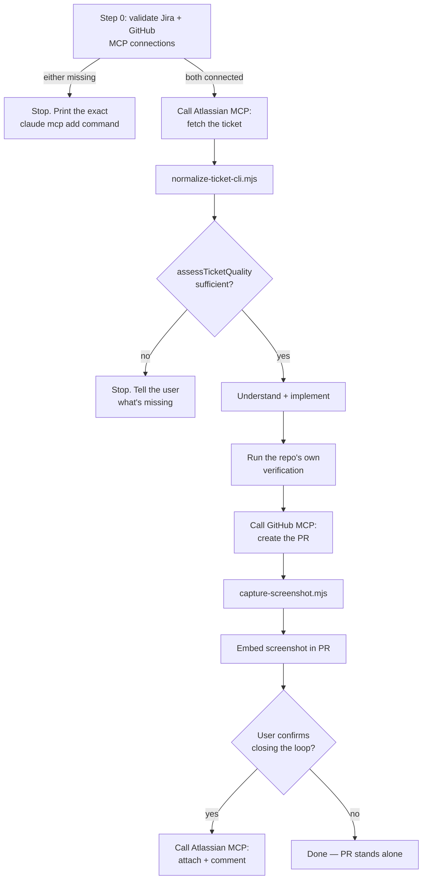

# jira-to-pr-workflow-mcp

The MCP-native sibling of
[jira-to-pr-workflow](https://github.com/juan-rome/jira-to-pr-workflow):
same real pipeline (fetch a ticket, refuse to implement it if it isn't
actually ready, implement it, open a PR with a real screenshot, optionally
close the loop on the ticket), but Jira and GitHub access go through the
Atlassian and GitHub MCP servers a user connects to their own Claude Code,
instead of a personal API token and the `gh` CLI.

**Status: dogfooded.** A real run against a live Jira sandbox and a real
GitHub repo confirmed the full pipeline end to end, including the one
thing that was genuinely unconfirmed at build time — whether the
Atlassian MCP server supports attaching a file and commenting on a ticket.
It does. See [`RUNS.md`](RUNS.md) for the actual run, including one real
bug it found and fixed, and [SKILL.md](SKILL.md#whats-still-unconfirmed)
for the two smaller things still open (the exact Jira description
response shape, and whether a real @-mention is supported).

## Why a separate repo instead of a v1 rewrite

v1 already has real dogfood evidence (two real tickets processed against
a live Jira sandbox — see its own `RUNS.md`). Rewriting it in place would
put that evidence at risk for an approach that hadn't been proven yet.
This repo exists so both versions of the same real workflow can stand on
their own: one shows a hand-rolled REST client is enough for a one-off,
single-user tool; this one shows what changes when Jira/GitHub access is
a standing, MCP-managed connection instead — the exact case MCP is
actually built for, as opposed to a private, single-shot API call.

## Why the quality gate is still the actual point

The differentiator isn't the transport, it's still refusing to implement
an underspecified ticket. `assessTicketQuality` is imported directly from
`jira-to-pr-workflow` (a real git dependency, not a reimplementation) so
both versions of this workflow always agree on what counts as ready.

## How it works



1. **Step 0 (new — v1 has no equivalent)** — validate that both the
   Atlassian and GitHub MCP servers are actually connected and
   authenticated before touching a real ticket, with a specific
   `claude mcp add` command printed for whichever one isn't.
2. **`scripts/normalize-ticket-cli.mjs`** — a CLI wrapper (added after the
   first real run hit a Node module-resolution bug calling
   `normalize-ticket.mjs` from outside this repo's own directory) that
   reshapes whatever the Atlassian MCP server's Jira tool returns (a raw
   ADF document or already-flattened text — both handled) into the exact
   ticket shape v1's quality gate expects, and returns the gate's verdict
   in the same call.
3. **`quality-gate.mjs`** (imported from `jira-to-pr-workflow`, unchanged)
   — decides whether the ticket has enough in it to implement responsibly.
4. **[`SKILL.md`](SKILL.md)** — the actual workflow: stop if the gate
   fails, otherwise understand → implement → verify → create the PR via
   the GitHub MCP server (checking for an existing one first) → screenshot
   → optionally close the loop on the ticket via the Atlassian MCP server.
5. **`scripts/pr-body.mjs`** — builds the PR body from structured parts
   (ticket link, what changed, tradeoffs, test plan) and throws if any
   section is missing, so a PR opened via the GitHub MCP server can't go
   out incomplete the way a hand-typed body could.
6. **`scripts/capture-screenshot.mjs`** — copied from v1 unchanged;
   Playwright screenshotting isn't Jira/GitHub-specific and has no MCP
   equivalent.

## Install

```bash
npm install   # pulls in jira-to-pr-workflow (for its quality gate and ADF
              # parser) and Playwright (for capture-screenshot.mjs only)

claude mcp add --scope user --transport http atlassian https://mcp.atlassian.com/v2/mcp
# then in a Claude Code session: /mcp   (OAuth)

claude mcp add --scope user --transport http github https://api.githubcopilot.com/mcp/ \
  --header "Authorization: Bearer YOUR_GITHUB_PAT"
# GitHub's MCP endpoint doesn't support OAuth's dynamic client
# registration (confirmed, not assumed) — see SKILL.md's Setup section
# for the exact PAT scope this needs and how to avoid it landing in
# shell history.
```

## Use

Ask Claude Code to "work ticket DEMO-1 using my Jira MCP connection and
open a PR," from inside the target repo, referencing this skill's
absolute path (see [SKILL.md](SKILL.md#step-1--fetch-the-ticket-via-the-atlassian-mcp-server)
for why the path has to be absolute). Claude follows `SKILL.md`, starting
with validating both MCP connections.

## Testing this repo itself

```bash
npm test   # test-normalizer.mjs (both response shapes normalize-ticket.mjs
           # has to handle, checked against the exact quality gate imported
           # from jira-to-pr-workflow) + test-pr-body.mjs (the PR body
           # template, including that a missing section throws instead of
           # silently shipping an incomplete PR) + test-normalize-cli.mjs
           # (regression test for the real module-resolution bug found in
           # the first live run, run from an unrelated cwd on purpose)
```

Fixture-based, no live Jira/GitHub/MCP session needed — same reasoning
`jira-to-pr-workflow`'s own tests give for avoiding live credentials in CI.

## What this does not do (yet)

See [SKILL.md's "What's still unconfirmed"](SKILL.md#whats-still-unconfirmed)
for the two smaller open questions: the exact Jira description response
shape, and whether a real Jira @-mention (not just a plain PR-link
comment) is supported.

It also doesn't decide priority, negotiate scope, or auto-merge — same as
v1, opening the PR is the end of the workflow.

## License

MIT — see [LICENSE](LICENSE).
