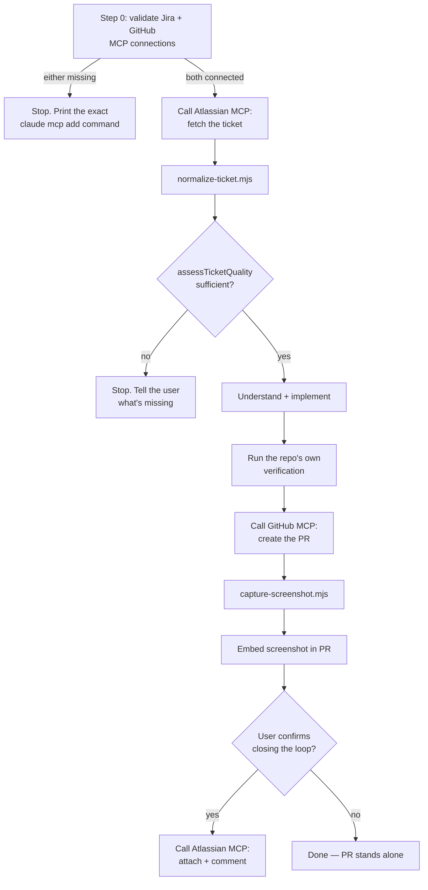

# Jira → PR (MCP-native)

The same real pipeline as
[jira-to-pr-workflow](https://github.com/juan-rome/jira-to-pr-workflow):
fetch a ticket, gate it on quality, implement it, prove it visually,
explain it. The difference is transport, not judgment — Jira and GitHub
access go through the Atlassian and GitHub MCP servers the user already
connected to their own Claude Code, instead of a personal API token and
the `gh` CLI. The quality gate itself (`assessTicketQuality`) is imported
unchanged from that repo: refusing to implement an underspecified ticket
doesn't get weaker just because the transport changed.



## When to use this

The user wants the Jira-to-PR pipeline run through their **own connected
MCP servers** rather than a personal API token — e.g. "work ticket X using
my Jira MCP connection." If they haven't connected Jira/GitHub via MCP and
don't specifically want to, use
[jira-to-pr-workflow](https://github.com/juan-rome/jira-to-pr-workflow)
instead; that version's REST/`gh`-CLI setup has fewer moving parts for a
one-off run.

## Setup (once)

```bash
claude mcp add --transport http atlassian https://mcp.atlassian.com/v2/mcp
claude mcp add --transport http github https://api.githubcopilot.com/mcp/
```

Then, in a Claude Code session, run `/mcp` to complete authentication for
each (OAuth by default; an API token if your Jira/GitHub org has that
enabled). This is a one-time, per-machine setup — both connections are
then available to any skill that wants them, not just this one, which is
the actual point of using MCP here instead of a per-skill token.

`npm install` in this skill's directory once (pulls in
`jira-to-pr-workflow` as a git dependency, for its quality gate and ADF
parser, and Playwright for `capture-screenshot.mjs`).

## Step 0 — Validate both MCP connections before touching a real ticket

Before fetching anything, confirm both servers are actually connected and
authenticated: make one lightweight call against each (e.g. the Atlassian
MCP server's Jira search/read tool against the ticket key the user gave
you, and the GitHub MCP server's "who am I" or repo-lookup equivalent).

**If either call fails or the server isn't connected, stop immediately**
and tell the user exactly which command to run:

- Jira not connected → `claude mcp add --transport http atlassian https://mcp.atlassian.com/v2/mcp`, then `/mcp`
- GitHub not connected → `claude mcp add --transport http github https://api.githubcopilot.com/mcp/`, then `/mcp`

Don't proceed partway through the pipeline on a guess that a connection
"probably" exists — a clear stop here is worth far more than a confusing
failure three steps in.

## Step 1 — Fetch the ticket via the Atlassian MCP server

Call the connected Atlassian MCP server's Jira read/search tool for the
ticket key directly — **do not** try to fetch it with a spawned script;
MCP tool calls only happen inside your own tool-use loop, not from a child
process. Whatever shape it returns, pass it through:

```bash
node scripts/normalize-ticket.mjs   # invoked programmatically — see the
                                     # file for the exact normalizeTicket()
                                     # signature; it's cheaper to import it
                                     # directly than to shell out for one
                                     # object transform
```

`normalize-ticket.mjs` reshapes the MCP response into the same
`{ key, summary, description, acceptanceCriteria, testingPlan, status,
url }` shape `jira-to-pr-workflow` uses, handling both a raw ADF document
and an already-flattened plain-text description (the exact response shape
gets confirmed on the first real run — see **What's unconfirmed** below).

## Step 2 — Quality gate: don't implement an underspecified ticket

Import `assessTicketQuality` from `jira-to-pr-workflow`'s
`quality-gate.mjs` (a git dependency of this repo — see `package.json`)
and check `qualityCheck.sufficient` exactly as v1 does. If it's `false`,
**stop before writing any code** and name what's missing. This logic is
intentionally not reimplemented here; both versions of this workflow must
agree on what counts as a ready ticket.

If the user wants to proceed anyway with the gaps named, that's their
call — the gap should be named out loud first, not silently papered over.

## Step 3 — Understand before implementing

Identical to `jira-to-pr-workflow`: read the summary, description, and
acceptance criteria together, find the actually-relevant files in the
current repo, and don't expand scope beyond what the ticket asks for.

## Step 4 — Implement and verify

Make the change. Run whatever this repo's real verification is
(typecheck/lint/tests/build) before considering the ticket done.

## Step 5 — Open the PR via the GitHub MCP server

**First, check for an existing PR referencing this ticket** using the
GitHub MCP server's PR search tool, so re-running this skill on the same
ticket updates the existing PR instead of opening a duplicate.

Build the body with `scripts/pr-body.mjs`'s `buildPrBody()` — it throws if
any required section (ticket link, what changed, tradeoffs, test plan) is
missing, so the PR can't go out incomplete. Then call the GitHub MCP
server's create-PR tool directly (not `gh pr create` — this version's
whole point is going through the connected MCP server).

### Attach a real screenshot, not just a text description

```bash
node scripts/capture-screenshot.mjs <url> screenshot.png [--selector "css-selector"]
```

Same as v1 — Playwright screenshotting has no MCP equivalent and isn't
Jira/GitHub-specific, so this script is copied over unchanged. Commit the
screenshot and embed it in the PR body via its raw GitHub URL.

## Step 6 — Close the loop (optional, ask first)

Confirm with the user before running either of these, same as any other
action with real-world visibility:

- Attach the screenshot to the ticket via the Atlassian MCP server's
  attachment tool, if it exposes one.
- Comment on the ticket with the PR link via the Atlassian MCP server's
  comment tool, optionally mentioning a reviewer, if it supports a real
  mention (not just "@Name" as literal text, which notifies no one in
  Jira).

**What's unconfirmed until the first real run:** whether the Atlassian
MCP server's tool surface actually supports file attachment and a proper
mention node the way `jira-to-pr-workflow`'s hand-rolled ADF client does.
If it doesn't, say so plainly to the user and skip the unsupported part
rather than faking it with plain text that looks like it worked but
doesn't actually notify anyone.

## What's unconfirmed until the first real run

This skill was built without a live Jira/GitHub MCP session available —
completing an interactive `/mcp` OAuth login isn't possible inside a
non-interactive coding session. Two things specifically need confirming
against a real connection, and should be corrected here (and in
`normalize-ticket.mjs`) the first time this actually runs:

1. The exact shape the Atlassian MCP server's Jira read tool returns for
   `description` (raw ADF vs. already-flattened text) — `normalize-ticket.mjs`
   handles both, but only real output confirms which path actually fires.
2. Whether the Atlassian MCP server exposes attachment and real-mention
   tools at all (Step 6).

See `RUNS.md` for what's actually been verified so far.

## Security considerations

MCP's OAuth flow means no personal API token lives in an environment
variable on this machine the way `jira-to-pr-workflow` requires — the
connection is scoped and revocable from your Atlassian/GitHub account
settings instead. The tradeoff: you're trusting the MCP server's own
scope model (`read_jira`/`write_jira`/etc.) rather than a token you scoped
yourself, so review what permissions you grant when connecting.

## What this skill does not do

Same as v1: it doesn't decide priority, negotiate scope with a PM, or
handle a ticket whose acceptance criteria are missing or contradictory —
surface that back to the user rather than guessing. It doesn't auto-merge.
It also doesn't yet know whether Step 6 is fully supported by the
Atlassian MCP server — see **What's unconfirmed** above.
